# Dependency graph — v0.26.x → v1.0.0

> Nodes: 38 work orders. Edges: `Depends-on` relations extracted from each WO body.
> Critical path highlighted. Generated at 2026-04-20. Re-run after any WO edit.

## Mermaid graph

```mermaid
graph TD
  classDef critical fill:#f9c,stroke:#c06,stroke-width:3px,color:#000
  classDef planned fill:#eee,stroke:#888,stroke-dasharray:4 4
  classDef drafted fill:#dfd,stroke:#3a3

  subgraph W1 [W1 — v0.26.1 Security quick wins]
    WO01[WO-01 parseSingleRoot sanitize]
    WO02[WO-02 bridge origin assert]
    WO03[WO-03 pptxgenjs SRI]
    WO04[WO-04 sessionStorage cap]
    WO05[WO-05 crypto bridge token]
  end

  subgraph W2 [W2 — v0.27.x A11y + Bridge scaffold]
    WO06[WO-06 broken-asset + sandbox audit]
    WO07[WO-07 Trust-Banner]
    WO08[WO-08 bridge contract scaffold]
    WO09[WO-09 a11y axe gate]
    WO10[WO-10 keyboard nav]
    WO11[WO-11 contrast spec]
  end

  subgraph W3 [W3 — v0.28.x Bridge v2 + Types + Store]
    WO12[WO-12 bridge v2 hello]
    WO13[WO-13 bridge v2 schema]
    WO14[WO-14 types bootstrap]
    WO15[WO-15 telemetry scaffold]
    WO16[WO-16 store scaffold + ui slice]
    WO17[WO-17 selection slice]
  end

  subgraph W4 [W4 — v0.30.x History + RAF + Split]
    WO18[WO-18 history patch-based]
    WO19[WO-19 RAF coalesce]
    WO20[WO-20 split selection layers-panel]
    WO21[WO-21 split selection floating-toolbar]
    WO22[WO-22 boot split]
    WO23[WO-23 feedback split]
  end

  subgraph W5 [W5 — v0.27.2 UX dead-ends]
    WO24[WO-24 broken-asset banner]
    WO25[WO-25 starter deck rehome]
    WO26[WO-26 transform resolve banner]
    WO27[WO-27 undo chain chip]
  end

  subgraph W6 [W6 — v0.31.x Precision + Tokens + Multi-select]
    WO28[WO-28 snap+nudge engine]
    WO29[WO-29 banner unification]
    WO30[WO-30 tokens v2 semantic]
    WO31[WO-31 shift-click multi-select]
  end

  subgraph W7 [W7 — v0.32-33 Visual + Mobile + Telemetry + Plugin L1]
    WO32[WO-32 gate-visual]
    WO33[WO-33 tablet honest-block]
    WO34[WO-34 telemetry viewer]
    WO35[WO-35 entity-kind registry]
  end

  subgraph W8 [W8 — v0.35-37 Flake + Shortcuts + RC]
    WO36[WO-36 flake elimination]
    WO37[WO-37 shortcuts table]
    WO38[WO-38 v1.0 RC freeze]
  end

  %% Security + bridge dependency chain (critical path)
  WO01 --> WO08
  WO08 --> WO12
  WO12 --> WO13
  WO13 --> WO36
  WO36 --> WO38

  %% Store + history chain (also critical)
  WO14 --> WO16
  WO16 --> WO17
  WO17 --> WO18
  WO17 --> WO19

  %% A11y chain
  WO09 --> WO10
  WO09 --> WO11
  WO09 --> WO33

  %% UX banner chain
  WO14 --> WO24
  WO04 --> WO24
  WO07 --> WO24
  WO24 --> WO29
  WO27 --> WO29

  %% Tokens downstream
  WO30 --> WO32

  %% Module split ordering
  WO17 --> WO20
  WO17 --> WO21
  WO20 --> WO22
  WO22 --> WO37
  WO23 --> WO29

  %% Telemetry chain
  WO15 --> WO34
  WO08 --> WO34

  %% Bridge commands/entity-kinds
  WO13 --> WO35
  WO14 --> WO35

  %% Tablet chain
  WO29 --> WO33
  WO09 --> WO33

  %% Visual regression chain
  WO29 --> WO32
  WO32 --> WO38

  %% RC freeze gates all downstream
  WO32 --> WO38
  WO33 --> WO38
  WO34 --> WO38
  WO35 --> WO38
  WO37 --> WO38

  %% Shortcut table
  WO10 --> WO37

  %% Critical path highlight
  class WO01,WO08,WO12,WO13,WO17,WO18,WO36,WO38 critical

  %% Planned vs drafted
  class WO12,WO13,WO14,WO15,WO16,WO17,WO18,WO19,WO20,WO21,WO22,WO23,WO24,WO25,WO26,WO27,WO28,WO29,WO30,WO31 planned
  class WO01,WO02,WO03,WO04,WO05,WO06,WO07,WO08,WO09,WO10,WO11,WO32,WO33,WO34,WO35,WO36,WO37,WO38 drafted
```

## Critical path analysis

Critical path (8 nodes, ≈ 6 windows):

**WO-01 → WO-08 → WO-12 → WO-13 → WO-17 → WO-18 → WO-36 → WO-38**

| Node | Why critical |
|---|---|
| **WO-01** (parseSingleRoot sanitize) | Closes P0-02 (HIGH security). Its acceptance defines the contract for WO-08 bridge schema. If sanitization shape slips, downstream schema is wrong. |
| **WO-08** (bridge contract scaffold) | Seeds `bridge-schema.js` registry — the SSoT all later bridge messages validate against. Without it, WO-12/WO-13 cannot version. |
| **WO-12** (bridge v2 hello handshake) | Introduces version negotiation. Everything ADR-012 depends on this existing. Slip pushes the entire bridge v2 subtree. |
| **WO-13** (bridge v2 schema validation) | Applies per-message validators; gate-contract lights up. Feature-complete bridge v2 is the prerequisite for contract tests, telemetry ACKs, entity-kind external registry trust. |
| **WO-17** (selection slice migration) | First real store consumer. Validates the observable-store shape before any heavy migration (history patch-based, RAF coalesce). If selection slice API is wrong, WO-18 + WO-19 + WO-20/21 all need rework. |
| **WO-18** (history patch-based) | Closes P0-11 (14 MB/session memory → 2 MB). Largest single refactor. Slip here delays v0.30.1 and cascades to all W4 work. |
| **WO-36** (flake elimination) | Without deterministic gate-A/B/C, the final RC freeze cannot declare green. Slip here means gate-timeline slides and RC date moves. |
| **WO-38** (RC freeze) | Pure sync point. Cannot begin until all prior finished. Any upstream slip delays this by the same amount. |

### What happens if each critical node slips

- **WO-01 slips 1 week** → sanitization re-work + WO-08 bridge schema schema redesign + WO-12 hello handshake re-validation → 2–3 week downstream push.
- **WO-08 slips 1 week** → bridge v2 entire chain slips 1 week; telemetry ACK coverage blocked; gate-contract delayed.
- **WO-12 slips 1 week** → WO-13 blocked; bridge contract tests in WO-13 cannot execute; RC freeze date slides.
- **WO-13 slips 1 week** → WO-35 entity-kind registry injection path redesign if new schema fields needed; WO-36 flake fix for LN3 container-mode ACK marker may rework; gate-contract delays.
- **WO-17 slips 1 week** → W4 module splits (WO-18..23) cascade delayed; history ADR-017 review window slides.
- **WO-18 slips 1 week** → v0.30.1 tag slides; WO-27 undo-chain chip lacks patch-based undo; performance targets for v1.0 may miss by 20%.
- **WO-36 slips 1 week** → RC freeze cannot validate "3× consecutive green" — v1.0 RC declaration moves by 1 week minimum.
- **WO-38 slips** → v1.0 ship date slips 1:1.

### Near-critical paths (2-week slack each)

- **A11y path**: WO-09 → WO-10 → WO-37 (shortcuts) → WO-38. Dep on WO-10 keyboard-nav completeness feeding shortcut table.
- **UX banner path**: WO-24 → WO-29 → WO-32 / WO-33 → WO-38. Banner unification is a cross-surface prerequisite for visual + tablet gates.
- **Tokens path**: WO-30 → WO-32. Visual baselines drift if captured before tokens v2 settle.

## Graph notes

- Nodes styled `planned` (gray dashed) have no file authored yet; content is inferred from mission tables and `EXECUTION_PLAN_v0.26-v1.0.md` windows. Re-validate edges when those WOs land.
- Nodes styled `drafted` (green solid) have files in `docs/work-orders/W*/`.
- Nodes styled `critical` (magenta bold) are on the critical path.
- Not every transitive dependency is drawn — only the ones declared in each WO's `Depends on:` line. Minor transitive edges (e.g., WO-11 → WO-38 via the a11y gate) are implicit.

## Re-sync instructions

1. For each WO file in `docs/work-orders/W*/WO-*.md`, read the `Depends on:` field in the header block.
2. For each `WO-AA → WO-BB` edge, confirm both ends exist as nodes.
3. If an edge crosses a window boundary, check `EXECUTION_PLAN §"Merge & gating discipline per window"` for ordering.
4. Re-classify nodes between `planned` / `drafted` / `landed` based on file existence + `git log main`.
5. Re-compute critical path by counting longest dependency chain; update critical class if it changes.

## Links
- [INDEX.md](INDEX.md)
- [GATE-TIMELINE.md](GATE-TIMELINE.md)
- [AGENT-WORKLOAD.md](AGENT-WORKLOAD.md)
- [RISK-REGISTER.md](RISK-REGISTER.md)
- [EXECUTION_PLAN](../EXECUTION_PLAN_v0.26-v1.0.md)
